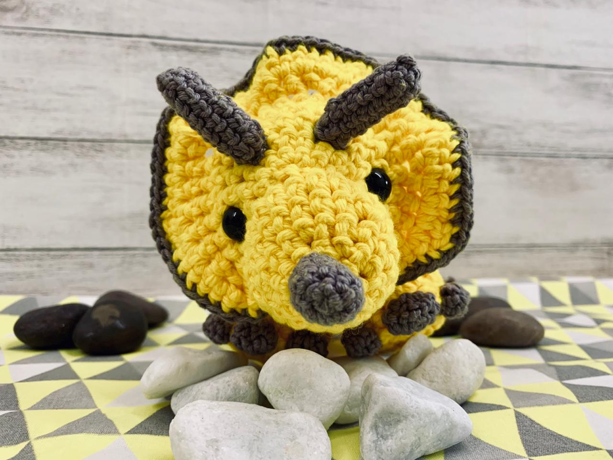

<!DOCTYPE html>

  <head>
  <title>Amigaluri</title>
   
  <link href="css/style.css" rel="stylesheet">

  </head>

  <body>

   <h1>Amigaluri</h1>

   <nav class="principal">
      <ul>
        <li>
        <a href="#Amigurumi">Amigurumi</a>
        </li>
       
        <li>
        <a href="#Amigaluri">Amigaluri</a>
        </li>
       
        <li>
        <a href="#Passoapasso">Tricerátops</a>
        </li>
      </ul>
 </nav>
    <section id=Amigurumi>

    <h2> o que é Amigurumi?</h2>
    
      
Amigurumi (編みぐるみ? lit. bicho de pelúcia feito de crochê) é uma técnica japonesa para criar pequenos bonecos feitos de crochê ou tricô.
      
      
 A criação de bonecos de crochê, apesar de ser um costume milenar, ressurgiu no Japão nos anos 80, com a onda estética  de objetos com aparência meiga e colorida (kawaii), o que demandou a produção de revistas de grande audiência feminina a publicar receitas passo-a-passo de como criar amigurumis.  

    
     
 Com a popularização da cultura japonesa ao redor do mundo, o amigurumi também ficou conhecido em outros países, e chegou aqui no Brasil por meio de livros e revistas vendidos em livrarias especializadas.
      

    
  <nav>
    <a target="_blank" href=" https://pt.wikipedia.org/wiki/Amigurumi"> 
      
    <h4>Conheça mais sobre Amigurumi aqui!</h4>
      
    </a>

  </nav>
 

      

      

 

    </section>

    <section id=Amigaluri>
 
    <h2> Quem é Amigaluri?</h2>

      
      
 
      
Olá, meu nome é Denise Luri Onari, eu moro em Sao Paulo  e sou descendente de japoneses. 

        
      
 Desde pequena fui incentivada a fazer trabalhos manuais e por volta dos anos 2000, frenquentando as livrarias japonesas localizadas no bairro da Liberdade tive meu primeiro contato com livros de passo-a- passo de amigurumi. 

      
      
 
      Com auxilio de parentes, eu consegui traduzir as receitas e fazer meus primeiros amigurumis.  A partir daí eu não parei mais e hoje desenvolvo minhas próprias receitas. 

      
 Na próxima sessão você poderá conferir uma dessas receitas, com o passo a passo para fazer um dinossauro tricerátops. 
 

      <nav>
      <a target="_blank" href="https://instagram.com/amigaluri?utm_medium=copy_link"> 
      
      <h4> Você pode conferir meus trabalhos no instagram @amigaluri </h4>
      
      </a>
      
      
      
    </section>

    <section id=Passoapasso>
 
    <h2> Passo a passo - Tricerátops</h2>
 
      
      

      
Essa receita é para crocheteiras avançadas, mas existem diversos kits básicos vendidos por marcas famosas de lã, para pessoas que estão começando agora. 

      <element class="receita">

        <h3> Materiais</h3>
        <ol>
          <li> 
duas cores de lã 
</li>
          <li>
 olhos para bichinhos de pelúcia
</li>
          <li>
 agulha de crochet conforme o tamanho da lã
</li>
          <li>
marcadores de ponto 
</li>
          <li>  
tesoura
</li>
        </ol>

       <h3>Legenda</h3>
  
          
Cor 1 -Amarela

          
Cor 2 - Cinza

          
 c - correntinha

          
 pb - ponto baixo

          
 pa - ponto alto 

          
 aum - aumento  
 
          
 dim - diminuição 

        <h3>Cabeça. Cor 1 - Amarela. </h3>

       
1.	6c no anel mágico

       
2.	2pb em cada c

       
3.	Repetir 6 vezes: 2 pb + 1 aum 

       
4.	Repetir 6 vezes: 3 pb + 1 aum 

       
5.	Repetir 6 vezes: 4 pb + 1 aum 

       
6.	Repetir 6 vezes: 5 pb + 1 aum 

       
7.	marcar e dar 1 volta completa.

      <h3> Osso da cabeça, “coroa". Cor 1 - Amarela.</h3>
      
       
8. 2pb Repetir 3 vezes

       
9. 1c + 1pa + 1c

       
10. 2pb repetir 3 vezes 

       
11. 1c + 1pa + 1c

       
12. 2pb Repetir 3 vezes 

       
13. 1c + 1pa+ 1c

      
14. 2pb Repetir 3 vezes

      
15. 1c + 1pa+ 1c

      
16. 2pb Repetir 3 vezes 

      
17. 1c + 1pa+ 1c

      
18. 2pb Repetir 3 vezes 

      
19. 1c + 1pa+ 1c

      
20. 2pb Repetir 3 vezes 

      
      
21. 6pb + 4 pb subindo para começar a fazer um “circulo” atrás deixando a coroa para fora dar a volta + 4 pb descendo para fechar um círculo nesse passo vamos completar uma volta.

      
      
Vamos parar agora para fazer o rosto do dino, aproveitando que a peça ainda está aberta.

      <h3> Parte da frente do rosto do dino. </h3>

      
22. 6c anel

      
23. 2pb em cada c

      
24. Repetir 6 x vezes 2 pb + 1 aum 

      
25. Repetir 6 x  vezes 3 pb + 1 aum 

      
26. Repetir 6 x vezes  4 pb + 1 aum 

      
27. Repetir 6 x vezes  5 pb + 1 aum

      
28. Encher a parte da frente do rosto com enchimento e costurar.

      
      <h3>Chifre nariz. Cor 2 - Cinza.</h3>

      
29. 6c anel mágico 

      
30. 2pb em cada c 

      
31. Dar 5 voltas de pb 

      <h3> Chifre testa. Cor 2 - Cinza. (Repetir 2x)</h3>
      
32. 6c anel

      
33. Dar 5 voltas com pb 

      
34. Costurar os chifres

      
35. Colocar os olhos

      
36. Detalhe da coroa 1pb, com cor 2.

      
37. Esconder todos fios por dentro do dino.

      
Agora vamos terminar o corpo do dino

      
38.	Usar marcador

      
39.	1 volta inteira com pb

      
 40.	1 volta inteira com pb, mas quando chegar na base do cabeça do dinossauro vamos diminuir a peça para criar um “queixo” somente nessa parte.
      3x 1dim 2pb 

      <h3> Vamos construir o pescoço agora. Cor 1 - Amarela.</h3>
      
      
41. 4 voltas com pb  
  
      
42. 1 volta com pb de 5 pb + 1 aum

      
43. 1 volta com pb de 4 pb + 1 aum

      
44. 5 voltas com pb. Aqui você pode alongar o corpo do dino, é só aumentar o número de voltas.

      
 45. Agora vamos começar a diminuição gradual para formar um rabo. Nessa diminuição vamos repetir as intruções por volta.

      
46. 1 volta com pb  5 pb + 1 dim

      
47. 1 volta com pb  

      
48. 1 volta com pb  4 pb + 1 dim 

      
49. 1 volta com pb  

      
50. 1 volta com pb  3 pb + 1 dim

      
51. 1 volta com pb  

      
52. 1 volta com pb  2 pb + 1 dim  

      
53. 1 volta com pb  

      
54. 1 volta com pb  2 pb + 1 dim  

      
55. Vá enchendo o dino com enchimento acrílico.

      
56.	voltas até o final formando a pontinha do rabo. Quando ficar bem afunilado, você pode finalizar com pb 1 pb + 1 dim 

      
      <h3>Pernas. Repetir 4 vezes. Cor 1 - Amarela.</h3>
      
57. 6 c fecha em um anel

      
58. 2pb em cada correntinha

      
59. Repetir 6 vezes: 2 pb + 1 aum 

      
60. 1 volta só pegando a alça de dentro do ponto, com pb  

      
61. 3 voltas com pb  

      <h3> Costas.Bolinhas. Cor 2 - Cinza.</h3>

      
Tamanho 1

      
62. 6c fecha em um anel

      
63. 2pb em cada correntinha

      
Tamanho 2

      
64. 6 c fecha em um anel

      
65. 2pb em cada correntinha

      
66. Repetir 6 vezes: 2 pb + 1 aum 

      
Tamanho 3

      
67. 6 c fecha em um anel

      
68. 2pb em cada correntinha

      
69. Repetir 12 vezes: 2 pb + 1 aum 

      
      <h3>Unhas do pé. Cor 2 - Cinza. Repetir 12 vezes</h3>
      
70.	4 c fecha em um anel, 2pb em cada correntinha. Costurar metade  da unha em baixo do pé e metade na frente.
      

      <h2> Muito Obrigada!</h2>

      </section class= "receita">

     </section>

  </body>
  <html/>

